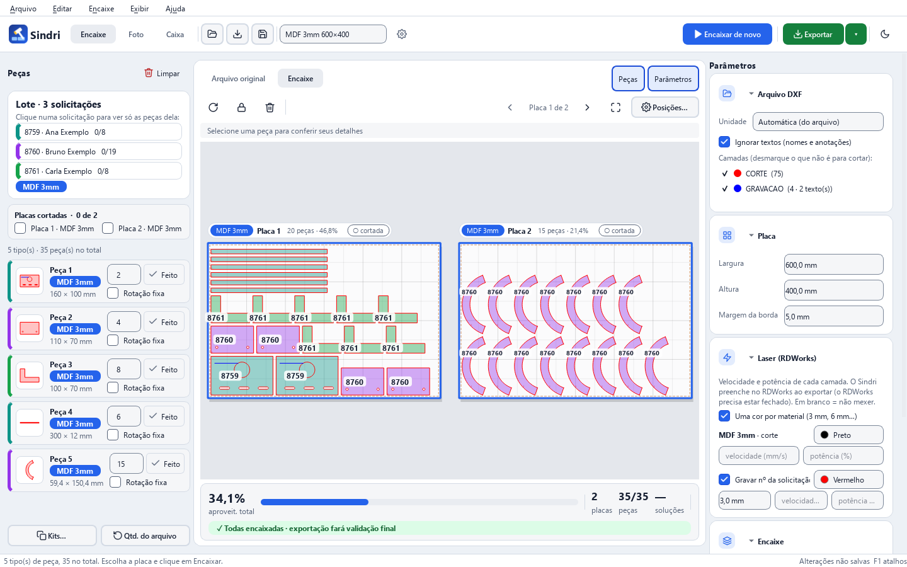
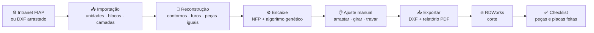
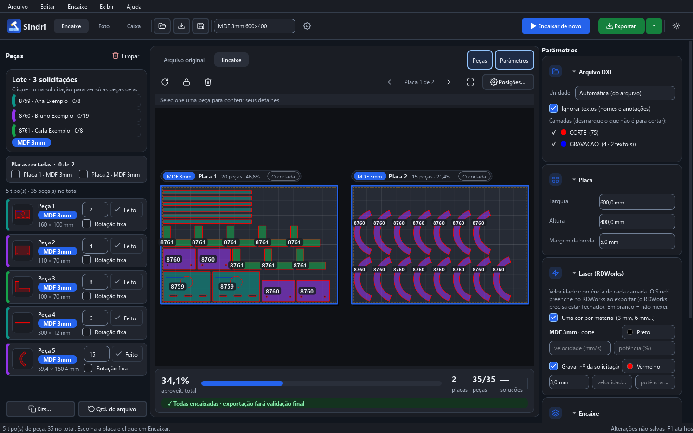
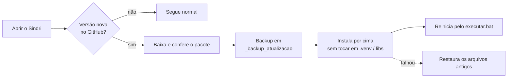
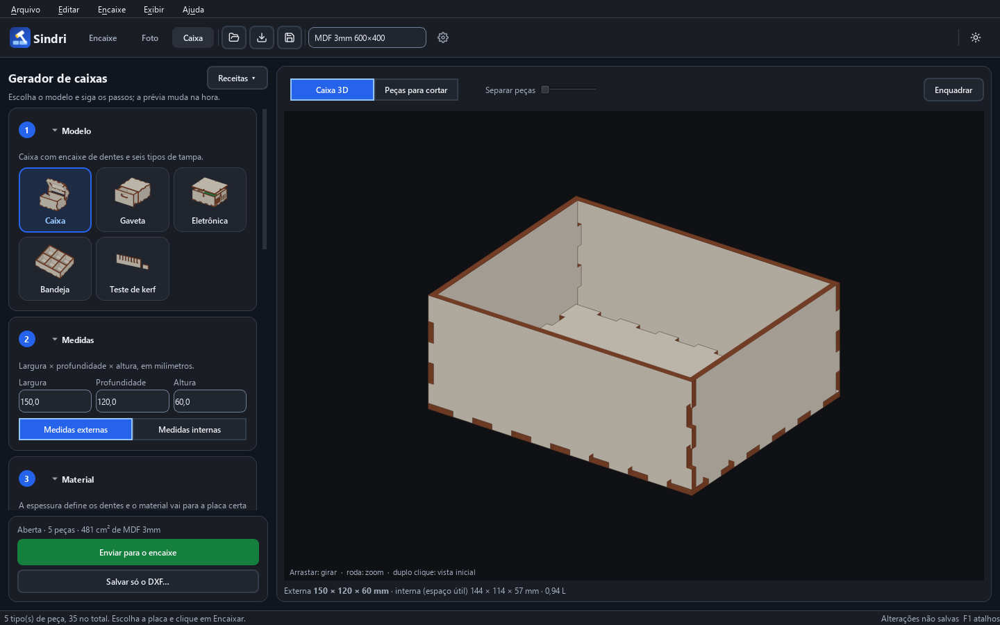
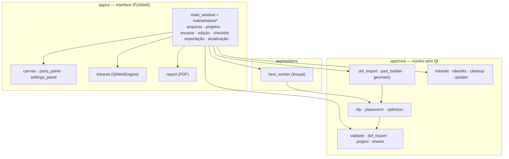

<div align="center">


# Sindri

**Encaixe automático de peças DXF para o corte a laser do Laboratório Maker FIAP**

Recebe os arquivos dos alunos (direto da intranet ou arrastando o DXF), organiza as peças da forma mais
compacta possível nas placas e entrega um único DXF pronto para o **RDWorks**, com relatório e checklist de corte.


[Como funciona](#-como-funciona) · [Recursos](#-recursos) · [Instalação](#-instalação-windows) ·
[Atalhos](#%EF%B8%8F-atalhos) · [Intranet](#-intranet-fiap) · [Arquitetura](#-arquitetura) · [Testes](#-testes)

<br>



<sub>Um lote com 3 solicitações em MDF 3 mm: cada peça leva a cor e o nº da solicitação de quem pediu.</sub>

</div>

---

## Interface redesenhada

Painéis de peças e parâmetros podem ser recolhidos pelos botões acima do desenho;
`Ctrl+Shift+P` alterna as peças e `Ctrl+P` alterna os parâmetros. Cabeçalhos com seta
recolhem as seções de configuração sem perder valores. O resumo da seleção aparece
acima do canvas, e os rótulos ficam menores conforme o zoom.

[Direção de design](DESIGN_DIRECTION.md) · [Recursos e créditos](ASSETS_CREDITS.md)

## ✨ Em resumo

| | |
|---|---|
| 🧩 **Encaixe inteligente** | No-Fit Polygon + algoritmo genético em paralelo (a mesma ideia do SVGnest/Deepnest), com peças dentro de furos, várias placas e rotações configuráveis |
| 🌐 **Direto da intranet** | Abre as *Solicitações Maker* dentro do programa, junta várias solicitações num lote e já começa a encaixar |
| 🎨 **Quem é cada peça** | Cada solicitação ganha uma cor; clique numa delas para ver só as peças daquela pessoa |
| ✅ **Checklist de corte** | Botão **Feito** em cada peça e caixinha por placa cortada, salvos junto com o projeto |
| 📐 **DXF fiel ao original** | Arcos continuam arcos, camadas e cores preservadas, furos antes do contorno, R2000 ou R12 |
| 📦 **Gerador de caixas** | Caixa (6 tampas), gaveta, caixa de eletrônica (Arduino/Raspberry), bandeja com rampas e teste de kerf, com receitas prontas e prévia 3D; as peças vão direto para o encaixe |
| ⚡ **Um clique até o laser** | `Ctrl+E` gera um DXF de corte por placa + conferência + `relatorio.pdf` e abre no RDWorks a 1ª placa |
| 🔄 **Sempre atualizado** | Ao abrir, procura versão nova aqui no GitHub e se atualiza com backup |

---

## 🔁 Como funciona



1. **Carregar.** Pela **Intranet FIAP** (`Ctrl+I`), marque uma ou várias solicitações e clique em **Juntar na placa → Enviar**,
   ou arraste DXFs para a janela (`Ctrl+O`).
2. **Encaixar.** O encaixe começa sozinho, melhora ao vivo e **para sozinho** quando passa um tempo sem melhorar
   (padrão: 40 s). O botão vira **Parar (Esc)** enquanto calcula.
3. **Ajustar** (se quiser). Arraste peças (ficam vermelhas se colidirem), gire (`R`), trave (`L`), mova entre placas e
   encaixe de novo só o restante.
4. **Exportar** (`Ctrl+E`). O RDWorks abre com a 1ª placa ainda não cortada:

   | Arquivo | Conteúdo |
   |---|---|
   | `nome_placa01_MDF3mm.dxf`, `nome_placa02_…` | **Um arquivo de corte por placa**: origem (0,0) no canto da chapa, sem contorno da placa |
   | `nome_todas_placas.dxf` | **Conferência**: todas as placas lado a lado, com “PLACA 1”, “PLACA 2”… (não é para cortar) |
   | `nome_relatorio.pdf` | Resumo e uma página por placa, com o nº da solicitação em cada peça |

   O aviso final mostra, camada por camada, o que o RDWorks deve mostrar (cor, operação, modo, velocidade/potência,
   saída). Confira em 10 segundos antes do Start.
5. **Cortar e marcar.** No checklist (aba Peças), o botão **▶** ao lado de cada placa abre só o arquivo daquela placa
   (se a placa mudou desde a exportação, ele exporta de novo antes). Fluxo: **abrir → cortar → marcar → próxima**.
   `C` marca a placa da tela como cortada e vai para a próxima. Cada peça tem o botão **Feito**.

> [!IMPORTANT]
> **Ordem de corte no RDWorks.** O Sindri grava gravação → vinco → furos → contorno e o caminho entre peças, mas o
> RDWorks tem a própria otimização de caminho e pode reordenar tudo. Para manter a ordem do arquivo, no diálogo de
> otimização de caminho do RDWorks desligue a reordenação automática (e deixe as camadas na ordem do aviso final:
> números/gravação antes do corte). Os nomes exatos dos campos variam entre versões do RDWorks V8 — confira na
> máquina do laboratório e anote aqui o ajuste que respeita a ordem do arquivo.

---

## 🧰 Recursos

<table>
<tr>
<td width="50%" valign="top">

### 📥 Importação
- LINE, ARC, CIRCLE, LWPOLYLINE/POLYLINE (com bulge), SPLINE, ELLIPSE
- Blocos `INSERT`/`MINSERT` aninhados, com escala e rotação
- Unidades do arquivo (`$INSUNITS`) convertidas para mm, com correção **por arquivo** quando a unidade declarada é absurda
- Camadas listadas com cor; textos ignorados por padrão

### 🧩 Reconstrução das peças
- Encadeia linhas e arcos soltos e fecha contornos quase fechados
- Remove linhas duplicadas
- Liga furos, rasgos, gravações e textos à peça que os contém
- Agrupa peças idênticas, mesmo giradas
- Destaca contornos abertos em vermelho

</td>
<td width="50%" valign="top">

### ⚙️ Encaixe
- NFP com cache e algoritmo genético em todos os núcleos
- Part-in-part: peças pequenas dentro de furos grandes
- Várias placas; **materiais diferentes nunca dividem placa**
- Rotações configuráveis, espelhamento opcional, trava de rotação por peça
- Quantidades editáveis e kits (`× Kits`)
- Verificação final com geometria fina antes de exportar

### 📤 Exportação
- Geometria **original**, só girada e movida
- mm, origem em (0,0), camadas e cores mantidas
- R2000 (padrão) ou R12
- Furos antes do contorno externo; caminho curto entre peças, começando no canto do home da cabeça
- Um DXF de corte por placa + arquivo de conferência; botão ▶ “abrir placa N no RDWorks” no checklist
- Gravação e vinco em camadas próprias (nunca na cor de corte); material proibido (PVC, vinil…) bloqueia

</td>
</tr>
</table>

### 💾 Projetos e segurança do trabalho
- **Projetos `.sindri`** guardam arquivos, parâmetros, quantidades, encaixe e checklist. A geometria fica
  **embutida no projeto**: ele abre mesmo se os DXF de origem forem movidos, e avisa se algum foi alterado.
- **Salvamento automático** em `Documentos\Sindri\ultimo_trabalho.sindri`, com oferta de recuperação ao abrir.
- **Limpeza** (*Arquivo › Limpar arquivos baixados e relatórios…*) manda solicitações baixadas, relatórios e
  exportações antigas para a **Lixeira**.

<div align="center">

<br><sub>Tema escuro (<code>Ctrl+T</code>)</sub>
</div>

---

## 💻 Instalação (Windows)

1. Instale o **Python 3.11** ([python.org](https://www.python.org/downloads/)) marcando **“Add python.exe to PATH”**.
2. Baixe este repositório (**Code › Download ZIP**) e extraia numa pasta.
3. Dê dois cliques em **`executar.bat`**. Na primeira vez ele prepara tudo (alguns minutos), cria o atalho
   **Sindri** na área de trabalho e no menu Iniciar, e abre o programa.
4. Daí em diante, abra pelo **atalho Sindri**.

<details>
<summary><b>Problemas na instalação?</b></summary>

- **Windows bloqueou uma biblioteca** (“Controle de Aplicativo”): o `executar.bat` tenta de novo e, se continuar
  bloqueado, usa o **Anaconda** do computador (o numpy dele costuma ser liberado), instalando o resto na pasta `libs`.
- **Algo quebrou depois de uma atualização**: feche o Sindri e rode **`reparar.bat`**, que reinstala as bibliotecas.
- **Registros de erro** ficam em `%LOCALAPPDATA%\Sindri\` (`sindri_erro.log` e `sindri_travamentos.log`).
- **Gerar um `.exe`** (opcional): `build_exe.bat` cria `dist\Sindri.exe`. Com o Controle Inteligente de Aplicativos
  ligado, um `.exe` sem assinatura também pode ser bloqueado.

</details>

### 🔄 Atualização automática

Ao abrir, o Sindri consulta este repositório. Se houver versão nova, aparece um aviso com **Atualizar agora**:



A versão instalada fica em `versao.txt`. Para desligar: *Ajuda › Procurar atualizações ao abrir*.

Cada atualização guarda um backup separado em `_backup_atualizacao/<data-id>`. Falhas de troca
dos arquivos acionam a restauração da versão anterior; eventuais falhas de restauração são informadas
com o caminho do backup. O programa impede o fechamento durante a instalação. O lançador verifica
também as versões mínimas das bibliotecas.

---

## ⌨️ Atalhos

| Arquivo | | Encaixe e edição | | Visualização | |
|---|---|---|---|---|---|
| `Ctrl+O` | Abrir DXF | `R` | Girar peça | `F` | Enquadrar tudo |
| `Ctrl+Shift+O` | Adicionar DXF | `M` | Espelhar peça | `N` | Nº em cima das peças |
| `Ctrl+I` | Intranet FIAP | `L` | Travar / destravar | `Ctrl+P` | Esconder parâmetros |
| `Ctrl+S` | Salvar projeto | `Del` | Remover peça | `Ctrl+T` | Tema claro/escuro |
| `Ctrl+E` | Exportar | `Ctrl+Z` / `Ctrl+Y` | Desfazer / refazer | `Alt+1…9` | Só a solicitação N |
| `Ctrl+Shift+E` | Exportar com opções | `C` | Placa cortada → próxima | `Alt+0` | Todas as solicitações |
| `Ctrl+Shift+Del` | Limpar tudo | `Esc` | Parar o encaixe | `F1` | Todos os atalhos |
| | | | | `Ctrl+1/2/3` | Encaixe / Foto / Caixa |

Roda do mouse = zoom · botão do meio (ou `Alt` + arrastar) = mover a vista.

---

## 🔥 Laser: camadas, potência e conferência

- **Corte × gravação**: cada linha recebe uma operação — corte (contorno e furos), vinco, gravação vetorial ou
  raster. O contorno externo é sempre corte; as outras cores seguem o que o técnico confirma em
  **Cores do arquivo → corte / gravação…** (a cor do contorno é corte; as outras, gravação; nomes de camada como
  `FUROS`, `VINCO`, `GRAVACAO` ajudam). No modo **uma cor por material**, só o corte vai para a cor do material.
- **Material proibido**: PVC, vinil, policarbonato, ABS, fibra de vidro e couro sintético bloqueiam a exportação.
- **Potência mín./máx.**: o Sindri preenche velocidade e potência mínima/máxima no RDWorks antes de abrir
  (mínima automática = 65% da máxima no corte). Máquina de **1 tubo** por padrão: o tubo 2 não é tocado.
  Depois de gravar ele **lê de volta** e mostra o que foi aplicado.
- **⋯** em cada linha do laser: modo (corte/scan), passadas, intervalo do scan, bidirecional e sopro. Esses campos
  aparecem na conferência para você ajustar no RDWorks.
- Para descobrir onde o RDWorks guarda outros campos (saída, modo…): `python tools/config_diff.py antes.cfg depois.cfg`.

### 🗂️ Banco de materiais (`Ctrl+M`)

Uma tabela por material, salva em `Documentos/Sindri/materiais.json` — ou numa **pasta compartilhada do
laboratório** (botão *Usar pasta compartilhada…*), para todos os PCs usarem os mesmos parâmetros:

- espessura, **chapa padrão, margem e espaçamento** (vazio = usar o painel), peça mínima e **veio** (só 0°/180°);
- por camada (corte, vinco, gravação, raster): modo, velocidade, potência mín./máx., passadas, intervalo do scan;
- **kerf medido, data do último teste e quem validou** — teste com mais de 90 dias aparece com ⚠ no painel do
  laser (o tubo de CO₂ perde potência com o tempo: refaça a grade em vez de ir subindo a potência);
- **proibido** + motivo: bloqueia a exportação daquele material.

---

## 🌐 Intranet FIAP

O botão **Intranet FIAP** abre a página de *Solicitações Maker* num navegador dentro do programa.

- **Login:** feito por você, na própria página. A sessão fica salva e **o Sindri nunca vê sua senha**.
- **Fila completa:** lista todas as páginas da aba escolhida, em ordem de envio, com filtro por status e busca por
  nome, RM ou nº.
- **Visualizar antes de baixar:** clicar numa solicitação mostra aluno, RM, projeto, arquivos, materiais e quantidades.
  Nada é baixado até você enviar.
- **Lotes:** marque várias solicitações e use **Juntar na placa**. As peças de todas são encaixadas juntas, cada uma com
  seu nº. Peças de pedidos diferentes nunca são agrupadas, e o relatório lista cada solicitação.
- **Adicionar ao lote aberto:** com solicitações já abertas, abra a intranet de novo (ou `Ctrl+Shift+I`) e envie
  outra: escolha **Adicionar ao lote**. As peças que já estavam mantêm posição, placas cortadas e ✓ Feito; no
  encaixe, “Só o que falta” preserva as placas já cortadas.
- **Onde ficam os arquivos:** `Documentos\Sindri\Solicitações\<nº> - <aluno>\<material>\`.

> [!NOTE]
> Cada material (ex.: MDF 3 mm, MDF 6 mm) ganha suas próprias placas, com a cor no contorno e na etiqueta.
> Arrastar uma peça para a placa de outro material deixa ela vermelha.

---

## 🖼️ Gravação de foto

Na aba **Gravação de foto** (topo da janela, ou `Ctrl+2`), abra uma imagem (ou arraste o arquivo) e o Sindri a
transforma em **linhas horizontais com potências diferentes**, prontas para gravar em madeira/MDF:

- **Tamanho e posição** em mm na placa atual — arraste a foto na placa ou use *Centralizar*.
- **Espaço entre linhas** (ex.: 0,25 mm) e até **5 níveis de potência**; o *pontilhado* mistura níveis vizinhos
  para parecer que há muito mais tons.
- **Brilho, contraste, gama**, *ignorar claros* (fundo limpo), *inverter* e *moldura*.
- **Velocidade e potência** do tom mais escuro e do mais claro; cada nível vira uma cor/camada no RDWorks
  (preto, azul, vermelho, verde, amarelo) e o Sindri preenche a potência de cada uma ao exportar.
- A pré-visualização mostra como fica na madeira, com o número de traços e o tempo estimado.

---

## 📦 Gerador de caixas

Na aba **Caixa** (topo da janela, ou `Ctrl+3`), monte uma caixa para cortar sem desenhar nada. A configuração
segue passos numerados, no estilo do MakerCase, com botões ilustrados; a prévia 3D muda na hora e cada modelo
mostra só os passos de que precisa.

<div align="center">

</div>

**Modelos** (passo 1):

| Modelo | O que gera |
|---|---|
| **Caixa** | Caixa com dentes e seis tipos de tampa (abaixo), divisórias e alças |
| **Gaveta** | Móvel aberto na frente + gaveta que corre dentro, frente de acabamento com puxador vazado ou furo para puxador; divisórias dentro da gaveta |
| **Eletrônica** | Tampa presa com parafusos M3 e porca (rasgo em T nas paredes), furos de fixação de **Arduino Uno, Arduino Mega ou Raspberry Pi**, furo de cabo e ventilação |
| **Bandeja** | Organizador baixo com divisórias e **rampa** em cada compartimento para pegar parafusos |
| **Teste de kerf** | Pente com 7 rasgos (kerf de 0,00 a 0,30 mm, valores gravados) e uma tira: o rasgo em que a tira entra justa diz o kerf do laser |

**Receitas** (botão no topo do painel): Caixa para Arduino Uno, Caixa para Raspberry Pi, Organizador de parafusos
4 × 3, Porta-cartas (2 baralhos), Caixote com alças (MDF 6 mm), Gaveta de mesa, Baú de lembranças e Teste de kerf.

**Passos** (aparecem conforme o modelo): medidas (externas ou internas), material (MDF 3 mm, MDF 6 mm,
Acrílico 3 mm ou outro), tampa, gaveta, placa e furos, encaixe das arestas (**dentes** ou **lisa** para colar,
largura do dente numa chave de arrastar de 2× a 4× a espessura, e kerf), divisórias (colunas e linhas;
na vista de cima, um clique tira ou põe de volta cada divisória), extras (alças, rampas) e quantidade.

**Tampas** do modelo Caixa:

| Tampa | Como funciona |
|---|---|
| Aberta | Só base e paredes |
| Fechada | Tampa com dentes como as outras faces |
| Tampa solta | Placa de cima + guia colada por baixo que encaixa na boca da caixa, com furo para o dedo |
| **Baú** | Tampa que abre para trás numa dobradiça igual à do MakerCase: a lateral da tampa desce em diagonal até um nó com furo, que gira em volta de um disco preso numa lingueta da caixa |
| **Deslizante** | Corre por um rasgo nas laterais; a frente é mais baixa para a tampa passar |
| **Porta dupla** | Duas portas que abrem para os lados, com a mesma dobradiça do baú nos dois cantos |

Baú e porta dupla não usam parafuso: o disco do pivô encaixa na lingueta da parede da caixa (pode colar) e o
furo do nó da tampa passa por fora dele. O **diâmetro do pivô** é ajustável (automático = 4 × a espessura).

Na prévia, **Abrir tampa / gaveta** mostra a tampa girando no pino, deslizando ou levantando e a gaveta saindo; **Separar peças** mostra a
montagem; **Peças para cortar** mostra exatamente o que vai para o laser.
**Enviar para o encaixe** grava o DXF em `Documentos\Sindri\Caixas\` e coloca as peças na aba Encaixe (com a
quantidade e o material), juntando ao que já estiver aberto se você quiser. **Salvar só o DXF…** grava o arquivo.

Arcos e furos redondos saem como `CIRCLE`, os contornos como `LWPOLYLINE` fechada, em mm. Peças iguais (frente e
fundo, as duas laterais) são agrupadas no encaixe.

---

## 🖥️ Linha de comando

Também dá para encaixar sem interface:

```bash
python -m app.cli peças.dxf --placa 600x400 --margem 5 --espaco 2 --tempo 30 --saida resultado/
```

| Opção | O que faz |
|---|---|
| `--rotacoes 4\|8\|…` | Quantas rotações testar |
| `--espelhar` | Permite espelhar peças |
| `--sem-part-in-part` | Não coloca peças dentro de furos |
| `--versao R12\|R2000` | Versão do DXF exportado |
| `--contorno-placa` | Desenha o contorno das placas |
| `--permitir-parcial` | Exporta mesmo se nem todas as peças couberem |

Código de saída: `0` ok · `2` parâmetros inválidos · `4` encaixe incompleto.

---

## 🏗️ Arquitetura



<details>
<summary><b>Estrutura de pastas</b></summary>

```
sindri.py               lançador (registros em %LOCALAPPDATA%\Sindri)
executar.bat            instala o ambiente e abre o programa
reparar.bat             reinstala as bibliotecas
app/
  main.py               inicialização da interface (procura atualização ao abrir)
  cli.py                linha de comando
  core/                 núcleo SEM Qt
    dxf_import.py       leitura, unidades, blocos, cores
    part_builder.py     encadeamento, árvore de contenção, peças idênticas
    geometry.py         discretização, transformações, offset
    nfp.py              No-Fit Polygon / Inner-Fit Polygon com cache
    placement.py        decodificador (posicionamento)
    optimizer.py        algoritmo genético paralelo
    sheets.py           índice das placas (numeração, material, andamento)
    boxgen.py           gerador de caixas (dentes, divisórias, tampas, DXF)
    validate.py         verificação final com geometria fina
    collision.py        colisão para o ajuste manual
    dxf_export.py       DXF final (todas as placas + nº das placas)
    project.py          salvar/abrir .sindri (geometria embutida)
    intranet.py         leitura da intranet FIAP
    rdworks.py          abrir o RDWorks
    cleanup.py          limpeza de arquivos baixados/exportados
    updater.py          atualização pelo GitHub, com backup e reversão
    models.py           Part, Placement, NestResult, NestParams
  ui/
    main_window.py      janela principal
    mainwindow/         ui_build, files, projects, nesting, editing,
                        checklist, status, export, updates, boxes
    box_panel.py        aba Caixa (controles, vista 3D, peças planificadas)
    canvas.py           desenho das placas e peças
    parts_panel.py      peças, placas cortadas e solicitações
    intranet.py         janela da intranet
    report.py           relatório PDF
    settings_panel.py, dialogs.py, prefs.py, theme.py, icons.py, owners.py, render.py
  workers/nest_worker.py  coordena o encaixe sem travar a tela
docs/                   capturas de tela e revisão técnica
tests/                  pytest
```

</details>

Decisões de projeto (tolerâncias, espaçamento, formato do DXF) estão em [`DECISIONS.md`](DECISIONS.md). A revisão
técnica mais recente está em [`docs/REVISAO_TECNICA.md`](docs/REVISAO_TECNICA.md).

---

## 🧪 Testes

```bash
pip install pytest pytest-cov
python -m pytest --cov=app/core
```

215 testes cobrem importação, geometria, NFP, posicionamento sem sobreposição, otimizador paralelo, exportação R12/R2000
com reimportação, projetos, intranet (com página simulada), limpeza, atualização, CLI, o gerador de caixas (todos os modelos e tampas: montagem
conferida em 3D, voxel a voxel, sem sobreposição nem buracos, e as dobradiças abrindo sem bater) e um fluxo completo da interface em modo sem tela.

Os testes isolam preferências, salvamento automático, perfil de navegador e área de transferência.
O wheel pode ser conferido fora da árvore fonte com `python tools/check_wheel.py docs/dist` após
`python -m pip wheel . --no-deps --wheel-dir docs/dist`. A configuração de CI cobre Windows e Linux.
O registro das correções e limites de validação está em [`docs/MELHORIAS_IMPLEMENTADAS.md`](docs/MELHORIAS_IMPLEMENTADAS.md).

A CLI bloqueia layouts inválidos (retorno 3) e informa encaixe incompleto com retorno 4.
Use `--permitir-parcial` quando quiser exportar as peças que couberam; o retorno continua sendo 4.
`--unidade auto` usa a unidade declarada no arquivo; a correção heurística por arquivo pertence à interface.

---

## 🔬 Pendente de validação no laboratório

- [ ] Abrir os DXF exportados no **RDWorks** (R2000 e R12) e cortar uma placa de teste
- [ ] Comparar o aproveitamento com o encaixe manual de um arquivo real
- [x] Gerar o `.exe` no Windows com `build_exe.bat` e verificar a inicialização ([registro](docs/COMPILACAO_WINDOWS.md))
- [ ] Validar o fluxo completo de produção no executável
- [ ] Cortar uma caixa do gerador em MDF 3 mm e ajustar o kerf padrão do laboratório

---

<div align="center">
<sub>
Feito para o Laboratório Maker da FIAP · Referências: SVGnest e Deepnest (Jack Qiao, MIT), ezdxf, Shapely, pyclipper;
Burke et al. (2007) sobre NFP.
</sub>
</div>
