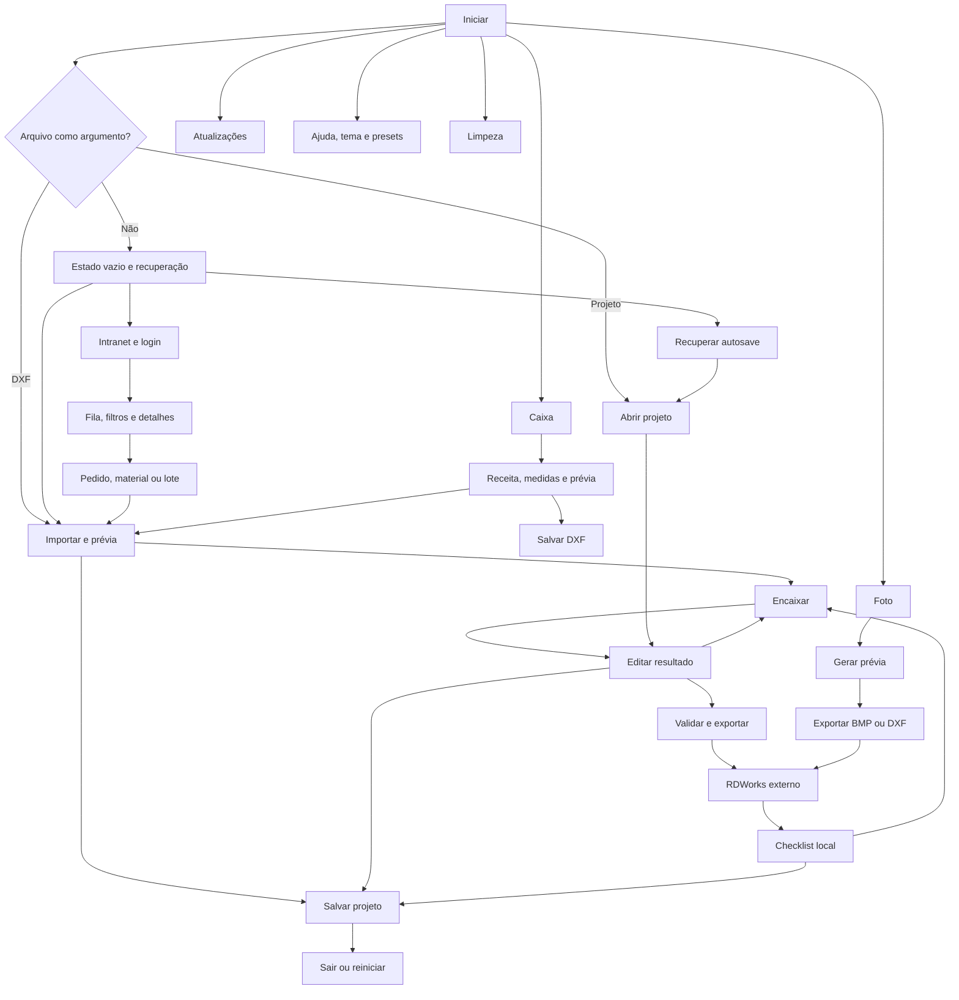
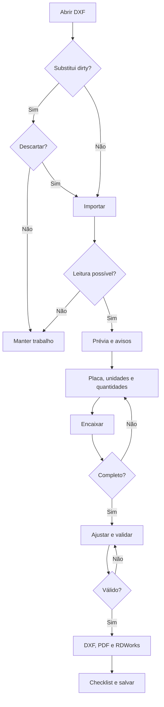
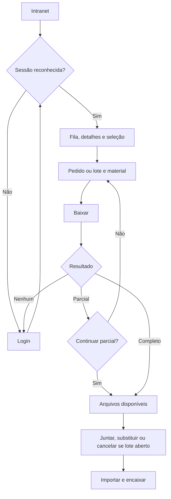
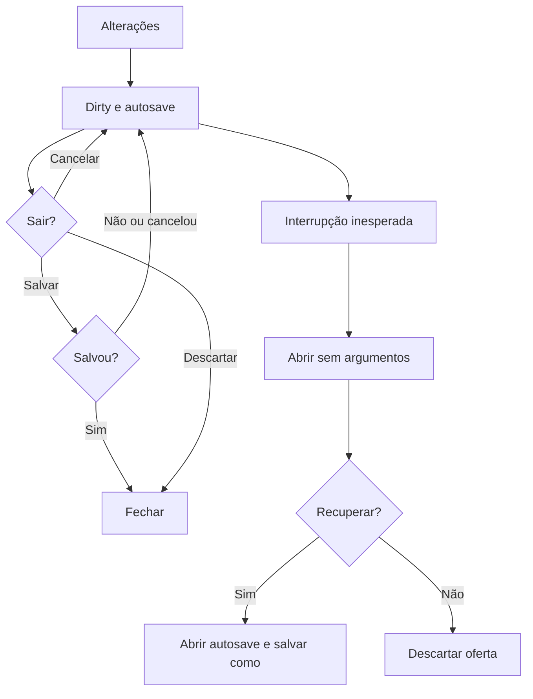
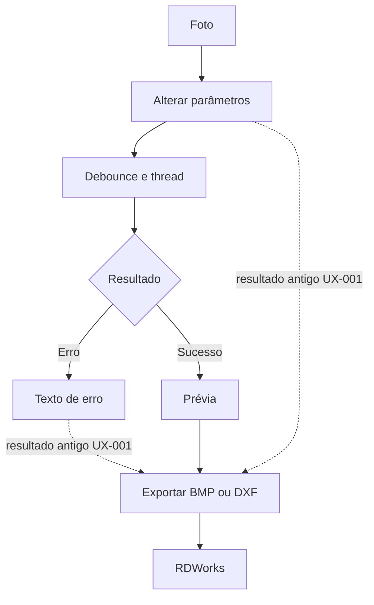
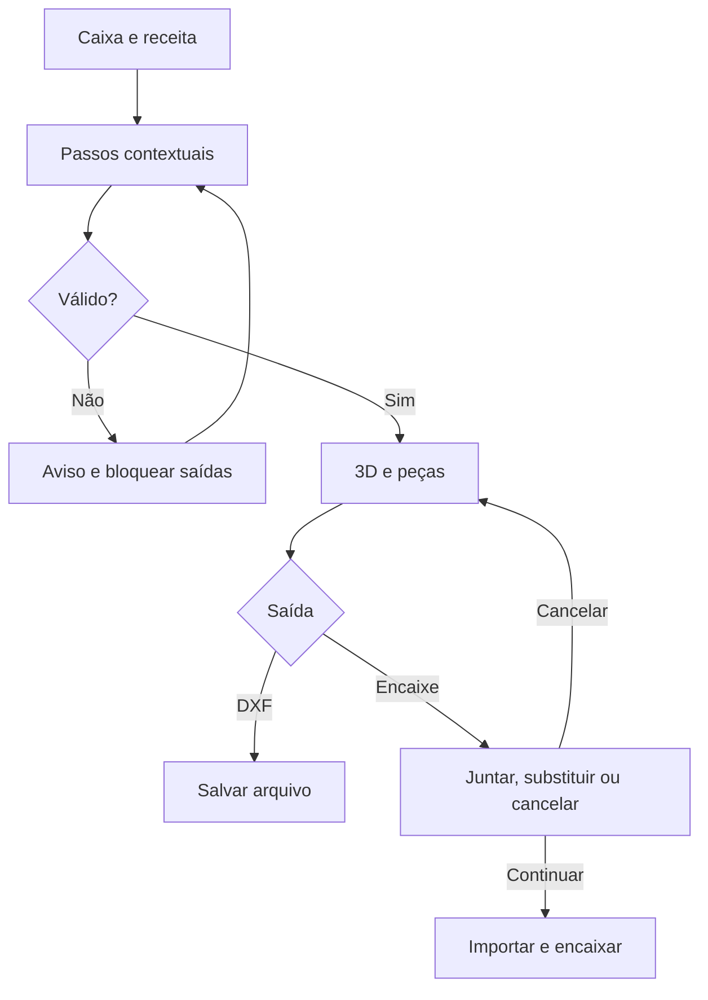
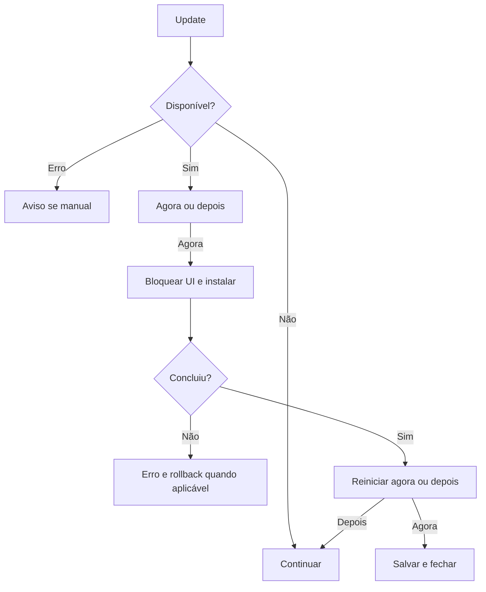

# RELATÓRIO UX — Sindri

Data: 08/10/2026. Branch main, commit c15e0f52e1863e5694de8255dd45f968ccb0b2d7.
Fonte: https://github.com/Muzashii/Sindri/tree/c15e0f52e1863e5694de8255dd45f968ccb0b2d7
Status: fases 1–4 concluídas em `ux/melhorias`, após autorização “implemente tudo”. A auditoria abaixo registra a linha de base; o changelog ao final descreve as correções e sua validação.

## 1. Sumário executivo

Sindri é um aplicativo desktop Python/PySide6 para organizar peças DXF em placas de corte a laser no Laboratório Maker FIAP. Integra intranet, projetos portáteis, RDWorks, checklist, fotos e geração de caixas. Público principal inferido da documentação: operadores do laboratório. Alunos são autores das solicitações, não um perfil local de autorização demonstrado.

**Nota heurística provisória: 6/10**, sem teste com usuários ou certificação. Rubrica de julgamento: orientação 6, controle/recuperação 8, feedback/consistência 6, acessibilidade 3, eficiência para experientes 7; média simples 6.

Pontos fortes: separação UI/núcleo, atalhos, undo/redo, geometria embutida no projeto, autosave, preservação do trabalho quando importação falha, downloads temporários, validação fina e exportação com staging.

**Top 5:** UX-001 (foto desatualizada exportável), UX-002 (edição por instância sem alternativa de teclado), UX-003 (divisórias dependem de mouse), UX-004 (estado pronto ignora colisões), UX-005 (contraste insuficiente).

15 problemas: 2 críticos para tarefas sem mouse, 6 altos, 6 médios e 1 baixo. Nenhum bloqueio geral do fluxo feliz de DXF foi demonstrado. Os riscos mais relevantes são inconsistência do estado exportável e exclusão em controles customizados.

## 2. Metodologia e escopo

Leitura estática de pontos de entrada, módulos da interface, callbacks, chamadas ao núcleo e testes existentes; inspeção visual de docs/tela_encaixe.png; cálculo de contraste pelas cores do código. Referências: [WCAG 2.2](https://www.w3.org/TR/WCAG22/) e [WCAG2ICT](https://www.w3.org/TR/wcag2ict-22/) para interpretação em software desktop. ARIA e rotas HTTP não são mecanismos nativos de Qt; recomendações usam foco, widgets nativos e QAccessible quando necessário.

**Limites da auditoria inicial (anteriores à implementação):** GUI, pytest, build, login institucional, RDWorks e corte físico não executados. Não foram instaladas dependências. A captura do repositório é ilustrativa: não mostra as três abas de modo presentes no código atual. Não se afirma que ela represente a versão auditada. Medidas reais de foco, alvos, leitor de tela, escala e desempenho exigem execução. Quantidade e aprovação dos testes anunciados no README não foram verificadas.

O catálogo cobre as famílias de ações identificadas na interface e suas ramificações relevantes, sem prometer enumerar todas as combinações infinitas de parâmetros/eventos nem páginas institucionais externas. Branches exe e feature/gerador-caixas fora do escopo. Evidências estáticas de comportamento são inferências dos caminhos de código, sem reprodução interativa.

Esforço: P = ajuste localizado; M = múltiplos componentes/estados; G = interação ou integração estrutural. Não são prazos.

## 3. Perfis e permissões

| Perfil | Capacidades observadas | Limites |
|---|---|---|
| Operador local sem sessão | DXF, projeto, encaixe, edição, checklist, foto, caixa, exportação, limpeza e atualização | Sistema de arquivos; não há guard por cargo local |
| Operador com sessão institucional | Local + fila, pesquisa, detalhes e downloads disponíveis à sessão | Autorização pertence à intranet; Sindri reconhece funções da página |
| Usuário CLI | Importar, parametrizar, encaixar, validar, exportar | Sem login, foto, caixa e checklist na CLI |
| Processo elevado RDWorks | Configuração e abertura quando Windows exige elevação | Contexto técnico; não é administrador do Sindri |
| Aluno/professor/admin institucional | Dados citados em solicitações | Matriz de permissões não demonstrada no aplicativo |

Não há cadastro, recuperação de senha ou logout local identificado. Confirmar perfis externos sem presumir acesso administrativo.

## 4. Mapa de navegação e inventário

| ID | Superfície | Entrada | Arquivos em app/ui |
|---|---|---|---|
| T01 | Janela e estado vazio | Inicialização | main_window.py, mainwindow/ui_build.py |
| T02 | Arquivo original | DXF/aba | canvas.py, mainwindow/files.py |
| T03 | Resultado em placas | Encaixe/projeto | canvas.py, mainwindow/nesting.py, editing.py, status.py |
| T04 | Peças, solicitações e checklist | Lateral | parts_panel.py, mainwindow/checklist.py |
| T05 | Parâmetros, laser e camadas | Lateral/Ctrl+P | settings_panel.py |
| T06 | Presets de placa | Combo/engrenagem | dialogs.py:PresetsDialog |
| T07 | Intranet: login/fila/detalhes | Ctrl+I | intranet.py |
| T08 | Lote/downloads | Seleção de pedidos | intranet.py |
| T09 | Opções de exportação | Primeira vez/Ctrl+Shift+E | dialogs.py:ExportDialog |
| T10 | Foto | Ctrl+2/aba | photo_panel.py, mainwindow/export.py |
| T11 | Caixa/3D/peças | Ctrl+3/aba | box_panel.py, mainwindow/boxes.py |
| T12 | Limpeza | Menu Arquivo | dialogs.py:CleanupDialog, mainwindow/files.py |
| T13 | Ajuda/atalhos/Sobre/avisos | F1/menu | mainwindow/ui_build.py, files.py |
| T14 | Recuperação/atualização | Inicialização/menu/banner | mainwindow/projects.py, updates.py |
| T15 | Arquivos e confirmações | Ações | QFileDialog/QMessageBox nos mixins |
| T16 | Terminal | sindri-cli | app/cli.py |

Entradas: argumentos DXF/projeto em app/main.py; arrastar DXF/projeto; imagem na área Foto; recuperação; callbacks locais open:, opts:, update:, later:, recover:, discard:. Nenhum deep link web ou notificação de sistema identificado. Não há rotas locais 404/403/500; esses estados podem existir no navegador externo/institucional.

Nenhuma superfície local inventariada foi demonstrada como órfã. Abrir projeto fica no menu e não no CTA inicial; mover peça depende de contexto do canvas. Personalizada pode apontar para painel invisível (UX-010). Extremos da navegação de placa podem permitir ação sem resultado (UX-015).

## 5. Catálogo de fluxos

O = operador local; I = operador com acesso institucional; C = CLI. Arquivos relativos à raiz; funções de interface pertencem a app/ui salvo indicação. Cancelar diálogos retorna à tarefa, salvo ressalvas.

| ID | Perfil | Gatilho → ações → resultado/alternativas | Arquivos/funções |
|---|---|---|---|
| F01 | O | Abrir sem argumentos → vazio → escolher DXF → prévia | app/main.py; mainwindow/files.py:load_files |
| F02 | O | Argumentos DXF → importar múltiplos; primeiro argumento projeto → abrir projeto | app/main.py |
| F03 | O | Arrastar DXF → adicionar se há lote; projeto → abrir; mistura → primeiro projeto tem precedência | mainwindow/files.py:dropEvent |
| F04 | O | Substituir DXF → confirmar descarte se dirty → importar/reset; recusar mantém trabalho | files.py:load_files/confirm_discard |
| F05 | O | Adicionar DXF → reimportar conjunto → quantidades equivalentes; layout depende de keep_layout | files.py:_import |
| F06 | O | Ilegível → erro e restaurar anterior; parcial → avisos | files.py:_import/load_files |
| F07 | O | Unidade suspeita → correção por arquivo; alterar unidade/camadas/textos → reprocessar | files.py:_ask_fix_units/reimport; settings_panel.py |
| F08 | O | Ajuda/importação → unidades/dimensões/avisos → corrigir desenho/parâmetros | files.py:show_import_details |
| F09 | O | Preset → dimensões; personalizada → foco largura; engrenagem → editar presets | files.py:_preset_chosen/edit_presets |
| F10 | O | Parâmetros → debounce → validar/checker; inválido → feedback | nesting.py:on_params_changed |
| F11 | O | Tipo de peça → quantidade/trava; kits → multiplicar original; restaurar quantidades | parts_panel.py; editing.py |
| F12 | O | Encaixar → validar → worker → melhores resultados → parada | nesting.py:start_nest/on_best/on_finished |
| F13 | O | Sem peça/quantidade zero/parâmetro inválido → impedir início ou explicar | nesting.py:start_nest |
| F14 | O | Espaço/Pausar → pausa/continua; Esc/Parar → melhor resultado | nesting.py:toggle_pause/stop_nest |
| F15 | O | Worker falha → erro → manter melhor solução → tentar/editar | nesting.py:on_failed |
| F16 | O | Incompleto/maior que placa → ajustar dimensões, rotações/quantidade → recalcular | status.py; nesting.py:_rebuild_checker |
| F17 | O | Reencaixar após corte → só pendentes/tudo/cancelar | nesting.py:start_nest |
| F18 | O | Selecionar/arrastar → mover instância/placa → colisão visual → corrigir | canvas.py; editing.py:on_items_released |
| F19 | O | R/M/L/Del → girar/espelhar/travar/remover; respeitar opções/travas | editing.py |
| F20 | O | Contexto → mover para placa compatível/nova → compactar numeração | editing.py:show_item_menu |
| F21 | O | Ctrl+Z/Y → restaurar posições, quantidades, checklist → dirty | editing.py:_snapshot/_restore |
| F22 | O | F/roda/Alt+arrastar/PgUp/PgDn → fit/zoom/pan/placa | canvas.py; status.py:goto_sheet |
| F23 | O | Pedido/Alt+1…9 → filtrar; Alt+0/clique novamente → todos; N → labels | checklist.py; canvas.py; ui_build.py |
| F24 | O | Feito/C/checkbox → checklist por tipo e placa → autosave; reset desmarca | checklist.py; parts_panel.py |
| F25 | O | Ctrl+S/Salvar como → destino → projeto portátil; cancelamento/erro mantém dirty | projects.py:save_project |
| F26 | O | Abrir projeto → confirmar → geometria/layout/checklist; inválido → erro; fonte alterada → aviso | projects.py:open_project |
| F27 | O | Alterar → autosave 2 s sem worker; abrir sem arquivo → recuperar/descartar; menu recupera | projects.py; app/main.py |
| F28 | O | Sair → parar worker → salvar/descartar/cancelar; Save falhou/cancelou mantém janela | main_window.py:closeEvent |
| F29 | O | Exportar → parar worker → validar fino; inválido bloqueia; incompleto confirma | export.py:export |
| F30 | O | Ctrl+E → opções anteriores/diálogo inicial → DXF+PDF; nome ocupado recebe sufixo; erro → mensagem | export.py; dialogs.py |
| F31 | O | Ctrl+Shift+E → opções; Ctrl+Alt+E/seta → placa individual sem PDF | export.py:_fill_export_menu |
| F32 | O | Exportado → localizar RDWorks → aplicar laser → abrir; já aberto → tentar/abrir sem aplicar | export.py:_open_in_rdworks/_apply_laser |
| F33 | O | RDWorks ausente/cancelado/falha → arquivos persistem → pasta/importação manual | export.py; core/rdworks.py |
| F34 | I/O | Ctrl+I → WebEngine? → navegador/login; indisponível/offline → mensagem | files.py:open_intranet; intranet.py |
| F35 | I | Login → solicitações reconhecidas → paginação; sessão perdida → navegador | intranet.py:_got_list/_start_crawl |
| F36 | I | Busca/status/ordem/refresh → fila → pedido → detalhes/material/arquivos | intranet.py:_fill_list/view_request |
| F37 | I | Marcar pedidos → juntar → detalhes sequenciais → material/todos | intranet.py:view_batch/_fetch_next/send |
| F38 | I | Enviar → download temporário → concluir → importar/encaixar automaticamente | intranet.py:_download_finished; files.py:_after_intranet_load |
| F39 | I | Erro/timeout → sem resposta; nenhum sucesso → login sugerido; parcial → continuar/repetir | intranet.py:_download_timeout/_finish_send |
| F40 | I | Novo pedido com lote aberto → juntar/substituir/cancelar; juntar preserva layout/corte | files.py:_ask_add_or_replace/_add_requests |
| F41 | O | Foto → abrir/arrastar → processar; ilegível → erro | photo_panel.py:open_image/dropEvent |
| F42 | O | Parâmetros de imagem → debounce/thread → prévia/estimativa; erro → texto | photo_panel.py:_changed/retrace/_traced |
| F43 | O | Arrastar/campos/centralizar → posição na placa; fora da borda → aviso | photo_panel.py:_dragged/center/_update_info |
| F44 | O | Exportar foto → pasta/nome livre → BMP ou DXF → RDWorks/scan; falha → erro | export.py:export_photo |
| F45 | O | Caixa → receita/modelo → passos contextuais → validar/gerar | box_panel.py:apply_recipe/regenerate |
| F46 | O | Colunas/linhas → clicar divisória; 3D → giro/zoom/abrir/separar; vista peças | box_panel.py:DividerEditor/_view_mode |
| F47 | O | Caixa inválida → primeiro erro → salvar/enviar bloqueados; corrigir → gerar | box_panel.py:regenerate |
| F48 | O | Enviar caixa → juntar/substituir/cancelar → DXF local → importar/encaixar | mainwindow/boxes.py:send_box_to_nest |
| F49 | O | Salvar caixa só DXF → destino → salvar/erro → permanecer | boxes.py:save_box_dxf |
| F50 | O | Limpar tudo → confirmar → vazio sem undo; limpar disco → categorias/Lixeira/permanente/erros | files.py:clear_all/cleanup_files |
| F51 | O | Ctrl+T/Ctrl+P/F1/Sobre → tema/painel/ajuda → retornar | ui_build.py |
| F52 | O | Consulta update → thread → nova/atual/erro; pacote/exe → instrução externa | updates.py:check_updates |
| F53 | O | Instalar → UI/fechamento bloqueados → instalar/rollback → reiniciar/depois; cancelamento do fechamento | updates.py; core/updater.py |
| F54 | C | CLI → argumentos → importar → otimizar → validar → exportar; retornos 0/1/2/3/4 | app/cli.py |

### Estados transversais e saídas

| Estado | Caminho observado | Limites |
|---|---|---|
| Vazio | CTA DXF; foto pede imagem; caixa inválida; fila | Validar fila vazia vs busca sem resultado |
| Carregando | Worker encaixe, thread foto/update; WaitCursor import/export | UX-008; skeleton não é requisito por si só |
| Sucesso | Métricas, pasta no banner, salvo/checklist | Mensagens temporárias e UX-009 |
| Parcial | Missing e confirmação export; downloads parciais confirmados | Contagem não localiza todos os problemas |
| Erro | Dialogs/textos para arquivo, projeto, rede, update e geração | UX-001/004/007 |
| Offline | Fluxos locais disponíveis; intranet/update falham | Não há indicador global; necessidade não demonstrada |
| Sessão expirada | Função da página ausente/zero downloads → login | Não diferencia todos os motivos |
| HTTP 403/404/500 | Possíveis no navegador institucional | Sem classificação própria comprovada; validar |
| Abandono | Cancelar, fechar intranet, Save/Discard/Cancel | Foto não integra projeto/dirty: UX-006 |
| Sem saída operacional | Inválido permanece para correção | Localizar erro e corrigir sem mouse são lacunas |

### Diagramas críticos

## 6. Problemas encontrados

Linhas correspondem ao commit auditado; caminhos relativos à raiz. Severidade é julgamento de impacto. Evidência estática não equivale a reprodução.

### UX-001 — Foto exportável com resultado desatualizado

- **Severidade:** 🟠 Alto. Nielsen 1/5; WCAG 3.3.1/4.1.3 como orientação.
- **Fluxos/tela:** F42/F44; T10.
- **Arquivos/linhas:** app/ui/photo_panel.py:445–465, 483–492, 574–617; app/ui/mainwindow/export.py:28–31, 48–78.
- **Evidência:** `_changed` agenda recálculo sem desativar exportação. `_traced` em erro retorna sem remover result nem bloquear botão. Exportação usa `_result_params` para geometria, mas parâmetros atuais e laser_values para outros valores. `_gen` só incrementa ao iniciar retrace; retorno anterior pode chegar durante debounce.
- **Impacto:** resultado anterior à configuração visível pode ser exportado; geometria e configuração podem divergir. Risco inferido do código, não reproduzido.
- **Solução:** invalidar revisão em `_changed`; estados generating/error/ready; bloquear saída em debounce/thread/erro; usar snapshot coerente para renderizar e exportar. Prévia antiga pode permanecer explicitamente marcada desatualizada.
- **Esforço:** M. **Aceite:** exportar imediatamente após mudar tamanho/modo não gera revisão antiga; erros e retornos atrasados não habilitam saída indevida.

### UX-002 — Posicionamento e seleção por instância dependem de mouse

- **Severidade:** 🔴 Crítico para essa tarefa sem ponteiro. Nielsen 3/7; WCAG 2.1.1/2.5.7.
- **Fluxos/tela:** F18/F20; T03.
- **Arquivos/linhas:** app/ui/canvas.py:175–187, 563–601; app/ui/mainwindow/editing.py:on_part_selected/show_item_menu/on_items_released.
- **Evidência:** PartItem tem selectable/movable, sem focusable. Não há keyPressEvent de movimento no canvas examinado. Lista seleciona todas as cópias de um tipo; contexto de mover placa depende do item sob a posição do evento.
- **Impacto:** R/L/Del ajudam, mas não oferecem seleção e posicionamento preciso de uma instância sem mouse.
- **Solução:** lista acessível de instâncias/placas, campos X/Y/ângulo/placa, setas com passo e ajuste fino, ações de mover no menu principal. Reutilizar snapshots, validação e autosave.
- **Esforço:** G. **Aceite:** selecionar uma cópia entre várias, posicionar/mudar placa e desfazer usando só teclado.

### UX-003 — Divisórias individuais sem alternativa de teclado

- **Severidade:** 🔴 Crítico para essa tarefa sem mouse. Nielsen 7; WCAG 2.1.1.
- **Fluxo/tela:** F46; T11.
- **Arquivos/linhas:** app/ui/box_panel.py:570–577, 603–610, 639–653.
- **Evidência:** editor customizado faz hit testing e emite toggled em mousePressEvent; não implementa foco e navegação por teclado equivalente nesse editor.
- **Impacto:** grade pode ser criada por campos, mas não é possível remover/repor uma divisória específica por esse caminho sem ponteiro.
- **Solução:** checkboxes nativos “Divisória vertical 1”/“horizontal 1” sincronizados com desenho, ou editor acessível com setas/Espaço. Preferir solução nativa simples.
- **Esforço:** M. **Aceite:** gerar mesma disposição pelo mouse e teclado.

### UX-004 — “Pronto para exportar” ignora colisões

- **Severidade:** 🟠 Alto. Nielsen 1/5/9; WCAG 1.4.1/3.3.1.
- **Fluxos/tela:** F18/F19/F29; T03.
- **Arquivos/linhas:** app/ui/mainwindow/status.py:43–53, 103–120; app/ui/canvas.py:227–229; app/ui/mainwindow/export.py:135–141.
- **Evidência:** `_mark_collisions` retorna quantidade, mas `_update_status` anuncia pronto com placements e sem missing, sem considerar colisões. Exportação valida finamente e bloqueia. Canvas usa preenchimento vermelho sem explicar tipo/local do problema.
- **Impacto:** estado contraditório e tentativa frustrada; identificar correção depende da visão.
- **Solução:** distinguir “Todas as peças encaixadas” de “Validado para exportar”; resumo persistente de colisão/borda/material com seleção dos envolvidos. Atualizar após edição e manter validação fina final, evitando custo por frame.
- **Esforço:** M. **Aceite:** sobreposição não anuncia pronto; usuário consegue localizar e compreender problema.

### UX-005 — Contraste insuficiente

- **Severidade:** 🟠 Alto. Nielsen 4; WCAG 1.4.3.
- **Telas:** T01/T04/T05/T11 conforme estado/tema.
- **Arquivos/linhas:** app/ui/theme.py:17–24, 31–33, 137–140, 189–191, 207; app/ui/parts_panel.py:50–54.
- **Evidência calculada sobre cores sólidas:** branco/#16a34a = 3,30:1 (Feito/success escuro); branco/#3b82f6 = 3,68:1 (primary escuro); #15803d/#14331f = 2,75:1 (nome feito escuro); branco/#ea580c = 3,56:1; branco/#ca8a04 = 2,94:1 (chips). Textos comuns de 8–9 pt não são texto grande; referência mínima 4,5:1.
- **Impacto:** baixa visão dificulta ler ações, materiais e estados.
- **Solução:** tokens de foreground/background por tema/estado, remover cor fixa de nome feito, escurecer fundos ou usar texto escuro apropriado. Auditar todas as cores de chips.
- **Esforço:** P. **Aceite:** pares de texto normal ≥4,5:1; confirmar no render o estilo efetivamente aplicado.

### UX-006 — Salvar projeto não representa trabalho de Foto

- **Severidade:** 🟠 Alto. Nielsen 3/4/5.
- **Fluxos/tela:** F25/F28/F41–44; T10.
- **Arquivos/linhas:** app/ui/mainwindow/projects.py:40–70; app/ui/main_window.py:102–114; app/ui/photo_panel.py:363–375.
- **Evidência:** salvar exige files de DXF; `_write_project` não serializa foto; fechamento confirma dirty and files. Preferências persistem parâmetros de foto, mas não incorporam imagem e trabalho ao projeto.
- **Impacto:** operador pode interpretar Salvar como ação sobre modo Foto; trabalho só com foto não recebe proteção de projeto.
- **Solução:** esclarecer “Salvar projeto de encaixe” e estado por modo; comunicar limite. Persistência completa de foto exige decisão e aprovação específica do esquema, sem alterar contrato silenciosamente.
- **Esforço:** P para clareza; G para persistência aprovada. **Aceite:** usuário entende o que foi salvo antes de sair.

### UX-007 — Falha da intranet confundida com login

- **Severidade:** 🟠 Alto. Nielsen 9; WCAG 3.3.3.
- **Fluxos/telas:** F34–39; T07/T08.
- **Arquivos/linhas:** app/ui/intranet.py:353–381, 939–946.
- **Evidência:** JSON inválido vira {}; ausência de temFuncao leva a “Faça login”; zero downloads sugere sessão expirada. Texto de download expressa possibilidade, mas não separa disco/rede/acesso/DOM.
- **Impacto:** repetir login pode não resolver acesso negado, mudança da página ou falha de rede.
- **Solução:** distinguir login detectado, página não reconhecida, falha de carregamento/download; preservar detalhe e oferecer refresh/navegador/repetir conforme evidência. Não afirmar status HTTP sem instrumentação.
- **Esforço:** M. **Aceite:** página não reconhecida não vira certeza de sessão expirada; simular offline, 403, timeout e DOM alterado.

### UX-008 — Operações custosas síncronas

- **Severidade:** 🟡 Médio, potencial alto em lotes grandes. Nielsen 1; desempenho percebido.
- **Fluxos/telas:** F06/F26/F29/F30/F45; T02/T03/T11.
- **Arquivos/linhas:** app/ui/mainwindow/files.py:162–179; projects.py:122–139; export.py:133–138, 192–228; app/ui/box_panel.py:1338–1350; nesting.py:167–177.
- **Evidência:** import_files/load_project/validate_layout/export_pdf/generate chamados sincronamente; WaitCursor não cria worker. stop_nest(wait=True) pode esperar até 30 s.
- **Impacto:** risco de janela sem resposta; tempo e travamento não medidos nesta revisão.
- **Solução:** benchmark real antes de refatorar; mover etapas custosas para workers com snapshots/progresso e cancelamento seguro quando aplicável. Não exibir sucesso otimista de exportação/validação não concluídas.
- **Esforço:** G. **Aceite:** event loop responsivo em lotes de referência e cancelamento sem perda.

### UX-009 — Recuperação e update disputam banner

- **Severidade:** 🟡 Médio. Nielsen 1/3/6.
- **Fluxos/tela:** F27/F52; T14.
- **Arquivos/linhas:** app/main.py:57–59; app/ui/mainwindow/projects.py:113–119; updates.py:60–65; ui_build.py:385–402.
- **Evidência:** ambos usam o mesmo QLabel via show_banner. Inicialização agenda recuperação aos 400 ms e consulta update aos 1500 ms. Update disponível pode substituir oferta não resolvida; info desaparece após 9 s.
- **Impacto:** recuperação segue no menu, mas perde destaque; trabalho recuperável pode passar despercebido.
- **Solução:** fila com prioridade de recuperação ou área independente; ações pendentes persistentes e histórico sem transformar todos os avisos em modais.
- **Esforço:** M. **Aceite:** autosave pendente + update deixam ambas ações acessíveis.

### UX-010 — Personalizada aponta para painel oculto

- **Severidade:** 🟡 Médio. Nielsen 3/6.
- **Fluxos/telas:** F09/F51; T05/T06.
- **Arquivos/linhas:** app/ui/mainwindow/files.py:52–59; ui_build.py:toggle_params.
- **Evidência:** ação só chama foco/selectAll na largura; painel pode estar oculto por Ctrl+P/preferência.
- **Impacto:** comando parece não funcionar e refere campo invisível.
- **Solução:** mostrar painel e sincronizar QAction antes do foco, ou diálogo de medidas.
- **Esforço:** P. **Aceite:** ocultar → personalizada → largura visível/focada.

### UX-011 — “Girar” significa permissão de rotação

- **Severidade:** 🟡 Médio. Nielsen 2/4; UX writing.
- **Fluxos/tela:** F11/F19; T04.
- **Arquivos/linhas:** app/ui/parts_panel.py:84–92; app/ui/mainwindow/editing.py:rotate_selected/on_rotation_lock_changed.
- **Evidência:** Girar/Fixa altera rotation_locked; R efetivamente gira placement.
- **Impacto:** botão sugere ação imediata quando muda uma restrição do cálculo.
- **Solução:** “Pode girar”/“Rotação fixa”; tooltip “no encaixe automático”; edição com “Girar agora”.
- **Esforço:** P. **Aceite:** teste de compreensão diferencia os dois comandos.

### UX-012 — Foco visual de botões sem tratamento explícito

- **Severidade:** 🟠 Alto, condicionado à confirmação visual no Fusion. Nielsen 4; WCAG 2.4.7.
- **Telas:** transversal.
- **Arquivos/linhas:** app/ui/theme.py:99, 132–153, 160; app/ui/mainwindow/ui_build.py:324–330.
- **Evidência:** outline:none global; regras :focus para campos, não para QPushButton/QToolButton. Não prova que todo foco nativo desapareça.
- **Impacto:** risco de perder orientação com Tab/Shift+Tab.
- **Solução:** realce de foco específico para controles; validar tabs, checkbox, menus e widgets próprios nos temas.
- **Esforço:** P. **Aceite:** foco visível ao longo de toda tarefa e no modo compacto.

### UX-013 — Semântica acessível customizada não demonstrada

- **Severidade:** 🟡 Médio provisório; leitor de tela pode elevar. WCAG 1.1.1/4.1.2/4.1.3.
- **Telas:** T03/T10/T11 e controles compactos.
- **Arquivos/linhas:** app/ui/mainwindow/ui_build.py:324–330, 507–520; app/ui/box_panel.py:454–561; app/ui/canvas.py:175–190.
- **Evidência:** QPainter/QGraphicsItem e slider próprio; busca em app/ui não encontrou setAccessibleName/setAccessibleDescription/QAccessible. Tooltips podem fornecer nomes via Qt; não se afirma que todo ícone seja anônimo.
- **Impacto:** relações, instâncias, valores e mensagens podem não ser expostos adequadamente.
- **Solução:** auditar árvore com NVDA; nomes estáveis quando texto desaparece; resumo textual por placa/instância; widgets nativos ou implementação acessível de slider. ARIA não resolve Qt nativo.
- **Esforço:** G. **Aceite:** anúncio de nome, função, valor e estado com contexto da instância.

### UX-014 — Descarte sem opção de salvar

- **Severidade:** 🟡 Médio. Nielsen 3/5.
- **Fluxos/tela:** F04/F26/F50; T15.
- **Arquivos/linhas:** app/ui/mainwindow/files.py:300–306, 388–395; app/ui/main_window.py:102–113.
- **Evidência:** substituição usa Yes/No para descartar; saída usa Save/Discard/Cancel. Comentário da limpeza menciona salvar, mas confirm_discard só pergunta descarte.
- **Impacto:** cancelar, salvar e repetir cria atrito; “Sim” genérico favorece erro de interpretação.
- **Solução:** helper Salvar/Descartar alterações/Cancelar; continuar somente após sucesso de Save. Reutilizar no fechamento e limpeza.
- **Esforço:** M. **Aceite:** SaveFileDialog cancelado ou erro impede substituição/limpeza.

### UX-015 — Navegação ativa nos extremos

- **Severidade:** 🟢 Baixo. Nielsen 1/4.
- **Fluxo/tela:** F22; T03.
- **Arquivos/linhas:** app/ui/mainwindow/status.py:55–72.
- **Evidência:** ambos enabled quando n>1; goto_sheet limita índice ao intervalo.
- **Impacto:** botão anterior na primeira/próxima na última aparenta ação sem efeito.
- **Solução:** atualizar enabled pelos extremos após mudar placa.
- **Esforço:** P. **Aceite:** primeiro sem anterior; último sem próxima.

### Pontos de validação, sem defeito confirmado

- Foto fora da placa: photo_panel.py:594–617 avisa mas mantém saída quando há conteúdo. Confirmar regra de reposicionamento externo, separando BMP/DXF antes de bloquear.
- Threads de foto: medir CPU/memória com mudanças rápidas; retrace cria thread a cada geração.
- Desktop responsivo: modo compacto existe; painéis têm larguras mínimas; Caixa 360/392 px, Foto 290/340 px. Testar 1366×768 e 1024×768, escalas 125/150/200%, altura útil e janela reduzida. Não afirmar corte de UI sem render.
- Alvos: ícone de 17 px não é tamanho do botão. Medir área/espaçamento e referência 24×24. Divisórias têm tolerância de 9 px por lado; avaliar equivalentes e exceções. 44 px não é condição AA universal.
- Feito é por tipo; progresso de cópias/placas existe. Confirmar se entrega parcial necessita status por instância antes de alterar modelo.
- 403/404/500, MFA, expiração em detalhe/paginação e DOM alterado requerem ambiente institucional controlado.
- PDF/RDWorks/corte: unidades, materiais, furos, labels e camada cinza sem saída devem ser validados no laboratório. README registra validações físicas pendentes.

### Cobertura dos critérios

| Critério | Avaliação |
|---|---|
| Nielsen 1: visibilidade | Bom progresso de cálculo; UX-001/004/008/009/015 |
| Nielsen 2: mundo real | Placa/material claros; UX-011; testar kerf/part-in-part |
| Nielsen 3: controle | Undo/Cancel fortes; UX-002/006/009/014 |
| Nielsen 4: consistência | Tokens/atalhos ajudam; UX-005/006/011/012/015 |
| Nielsen 5: prevenção | Validação fina/staging fortes; UX-001/004/006/014 |
| Nielsen 6: reconhecimento | CTA/receitas/passos ajudam; UX-009/010 |
| Nielsen 7: eficiência | Atalhos/CLI/presets fortes; UX-002/003 |
| Nielsen 8: minimalismo | Captura com hierarquia; densidade de três colunas/labels merece teste, sem defeito presumido |
| Nielsen 9: recuperação | Preserva trabalho e bloqueia inválido; UX-004/007/014 |
| Nielsen 10: ajuda | F1/tooltips/avisos; testar orientação sem hover |
| Fitts | Divisórias/instâncias pedem alternativas; áreas reais pendentes |
| Hick/Miller | Passos contextuais reduzem opções; não aplicar limite arbitrário de sete itens |
| Jakob/Gestalt | Menus/cartões ajudam; Girar quebra expectativa; cor pede redundância |
| WCAG | Contraste calculado e lacunas de teclado; foco/nomes/anúncios pendentes |
| Responsividade | Desktop compacto existe; mobile não é plataforma declarada; não recomendar reescrita web por isso |
| Desempenho percebido | Encaixe/foto/update assíncronos; import/export síncronos não medidos |
| UX writing | Melhorar validade, login/falhas, rotação e descarte |

## 7. Matriz de priorização

| Prioridade | ID | Impacto | Esforço | Motivo |
|---|---|---|---|---|
| P0 | UX-001 | Alto | M | Coerência de exportação |
| P0 | UX-002 | Crítico | G | Tarefa sem mouse |
| P0 | UX-003 | Crítico | M | Alternativa localizada |
| P1 | UX-004 | Alto | M | Validade antes de exportar |
| P1 | UX-005 | Alto | P | Contraste mensurável |
| P1 | UX-006 | Alto | P/G | Clareza já; persistência depende decisão |
| P1 | UX-007 | Alto | M | Diagnóstico externo |
| P1 | UX-012 | Alto condicional | P | Confirmar foco renderizado |
| P2 | UX-009 | Médio | M | Prioridade da recuperação |
| P2 | UX-010 | Médio | P | Tornar alvo visível |
| P2 | UX-011 | Médio | P | Rótulo coerente |
| P2 | UX-014 | Médio | M | Salvar antes de substituir |
| P2 | UX-008 | Médio potencial | G | Medir antes de refatorar |
| P2 | UX-013 | Médio provisório | G | Auditoria NVDA |
| P3 | UX-015 | Baixo | P | Limites de navegação |

Alto impacto/baixo esforço: UX-005/006(texto)/012. Crítico/médio: UX-003. Crítico/grande: UX-002. Não ordenar apenas por facilidade; UX-001 merece início mesmo com esforço médio.

## 8. Plano de implementação por ondas

**Pré-condição:** aprovação explícita dos IDs, conforme texto anexado. Nenhuma implementação feita. Branch ux/melhorias; não alterar núcleo, regras de negócio ou contratos. Persistência de foto exige aprovação específica do formato. Bibliotecas novas exigem justificativa/aprovação.

1. **Correções localizadas:** UX-001/005/010/011/012/015 e clareza de UX-006. Snapshot de foto, bloqueio em geração/erro, tokens/labels/foco e painel visível.
2. **Estado e recuperação:** UX-004/007/009/014. Resumo de validade, mensagens de falha baseadas em evidência, fila de avisos, confirmação consistente.
3. **Acesso completo:** UX-002/003/013. Instâncias, X/Y/placa, divisórias nativas, NVDA; mesmos comandos/snapshots de edição.
4. **Desempenho medido:** UX-008. Benchmark de importação/projeto/validação/caixa/exportação e workers somente nos gargalos comprovados.

Um problema/grupo coeso por commit com ID: `fix(ux): UX-001 bloqueia foto desatualizada`. Depois de cada onda, testes pertinentes e build; lint disponível no projeto, sem presumir ferramenta instalada. Evitar testes que só espelham implementação.

Regressões essenciais: resultado atrasado/erro de foto; Save cancelado/falhou; personalizada com painel oculto; sobreposição manual; autosave+update; teclado em divisórias/instâncias; zoom de Windows; peças feitas no escuro; download parcial; DXF no RDWorks. Base existente: tests/test_ui.py, test_reliability.py, test_photo.py, test_boxgen.py, test_export_project.py. Nesta revisão foram lidos, não executados; cobertura não equivale a conformidade de UX.

## 9. Métricas propostas

| Métrica | Definição | Uso |
|---|---|---|
| Conclusão sem ajuda | Corretas/iniciadas | DXF→exportação, caixa, foto |
| Tempo de tarefa | Mediana/p90; separar cálculo/interação | Lote real e edição |
| Erro de exportação | Bloqueadas/tentadas por motivo | Colisão, parcial, geração |
| Foto coerente | Arquivos com revisão correta/exportados | Mudanças rápidas/erro; alvo 100% |
| Abandono | Inícios sem conclusão/cancelados, com motivo | Login, lote, salvar, RDWorks |
| Recuperação | Recuperadas corretamente/cenários simulados | Autosave+update |
| Teclado | Tarefas equivalentes concluídas sem ponteiro/avaliadas | Instância/divisória; alvo 100% |
| Contraste/foco | Pares/controles conformes/avaliados | Temas/estados; alvo 100% do escopo |
| Latência | Input/event loop e tempo p95 por etapa | Lotes e hardware de laboratório |
| Compreensão | Distinguem rotação, corte e entrega/participantes | Rótulos/checklist |

Obter linha de base com operadores experientes e iniciantes e repetir mesmos arquivos/tarefas. Não inventar meta de tempo sem medir hardware. Usar observação e registros locais consentidos; não adicionar telemetria com dados dos alunos automaticamente.

## Perguntas abertas

1. Foto deve compor projeto portátil ou ser trabalho independente? O que deve persistir ao fechar?
2. Foto fora da placa é permitida para ajuste externo? Separar BMP/DXF.
3. Feito significa corte ou entrega? Há necessidade de acompanhamento por instância?
4. Menor resolução/escala suportada? Operação por toque?
5. Perfis/status disponíveis na intranet e ambiente de testes sem dados pessoais?
6. Parâmetros e camadas homologados no RDWorks/laser?

## Changelog de implementação

Implementação autorizada pelo usuário em 08/10/2026. Todos os 15 IDs receberam mudanças; a aprovação técnica não substitui testes com operadores ou homologação de acessibilidade.

| ID | Implementação |
|---|---|
| UX-001 | Foto invalida a revisão imediatamente; resultado atrasado/erro não habilita exportação. Exportação usa parâmetros da revisão válida e valores atuais de posicionamento/laser. |
| UX-002 | Editor por instância com lista de cópias, coordenadas, ângulo e placa; seleção individual, desfazer e validação existentes preservados. Menu e Ctrl+Shift+M. |
| UX-003 | Divisórias têm caixas de seleção nativas acionáveis por Espaço, sincronizadas com o desenho. Campos customizados substituídos por campos numéricos Qt; vista 3D aceita teclado. |
| UX-004 | Resumo sinaliza colisões/borda/material; “todas encaixadas” explicita validação final na exportação, sem declarar segurança do corte. |
| UX-005 | Cores de ação, materiais, texto de sucesso e peças feitas corrigidas nos dois temas. Teste verifica razão mínima 4,5:1 nos pares alterados. |
| UX-006 | “Salvar encaixe” e aviso persistente na Foto deixam claro o alcance do projeto. Foto continua independente, preservando formato e compatibilidade dos projetos existentes. |
| UX-007 | Falha de leitura, página desconhecida, conexão e autenticação recebem diagnósticos distintos; falha de download mostra o motivo disponível. |
| UX-008 | Importação, abertura de projeto, validação fina, exportação com staging e espera de worker usam tarefa em segundo plano e progresso com janela responsiva. Autosave/parâmetros aguardam operação ativa; fechamento protegido. |
| UX-009 | Recuperação tem prioridade e avisos posteriores ficam na fila, evitando substituição por atualização. |
| UX-010 | Escolher placa personalizada abre o painel e posiciona o foco no campo. |
| UX-011 | Caixa de seleção “Rotação fixa” comunica uma restrição; valor marcado impede rotação automática. |
| UX-012 | Removida supressão global de foco; borda de foco inclui controles com estilos específicos nos dois temas. |
| UX-013 | Nomes/descritivos de controles compactos, campos e áreas customizadas; associação de labels; valores numéricos nativos e atualização acessível de resumos. |
| UX-014 | Salvar/Descartar/Cancelar em substituição/fechamento/limpeza de trabalho alterado; cancelamento ou erro no salvamento impede descarte. |
| UX-015 | Anterior/próxima desabilitados nas extremidades e atualizados ao navegar. |

### Validação executada

- Suíte completa: 219 aprovados, 6 pulados, 177,65 s (pytest -o addopts='' -q).
- Testes de regressão novos cobrem revisão de foto, cópia individual/desfazer/colisão, divisórias por teclado, fila de avisos, painel oculto, salvamento cancelado/falhou, responsividade/erro de tarefas, nomes e valores acessíveis, diagnóstico intranet e contraste.
- `compileall` e `git diff --check`: aprovados. Não há configuração de lint adicional no projeto.
- Wheel gerado com `python -m build --wheel --no-isolation`; `tools/check_wheel.py dist` instalou o pacote em diretório temporário e abriu a janela principal fora do fonte. Aviso de depreciação de metadados de licença já existente no projeto.
- Renderização Qt offscreen, fonte Segoe UI, 1366×860: Encaixe claro/escuro, Caixa, Foto e editor de posições. Capturas entregues junto da implementação. Verificado visualmente foco no botão Exportar e legibilidade da restrição de rotação.
- Arquivo de amostra: importação pela UI ~1,87 s, validação fina ~0,011 s, PDF ~0,13 s; nenhum problema geométrico no cenário. Caixa padrão ~4 ms, caixa 10×10 ~32 ms. Medidas locais, uma execução, sem estimativa de p95 ou comparação causal entre máquinas.
- Geração de caixa ficou síncrona devido à baixa duração medida. Importação/exportação foram deslocadas para worker; diálogo bloqueia edição durante a operação para preservar consistência e processa eventos. Não anuncia cancelamento de operação sem suporte seguro.
- Núcleo de geometria, algoritmos, formato de projeto e APIs públicas preservados. Nenhuma dependência da aplicação adicionada; ferramentas de desenvolvimento foram instaladas no ambiente isolado.

### Validação ainda necessária no laboratório

NVDA real, fluxo completo só por teclado, zoom do Windows e múltiplas resoluções; login e downloads na intranet institucional; importação no RDWorks, parâmetros e corte físico; testes com operadores. Não se declara conformidade WCAG, nem se atribui nova nota sem reavaliação com usuários. As perguntas de produto anteriores continuam relevantes; para UX-006 foi adotada a solução de clareza sem ampliar persistência de Foto.

### Entrega

Branch local `ux/melhorias`. Alterações agrupadas em commits com IDs. Código-fonte completo em `Sindri-ux.zip`, patch em `Sindri-ux.patch`, pacote Python em `sindri-1.0.0-py3-none-any.whl`. Nenhuma publicação no GitHub realizada.

